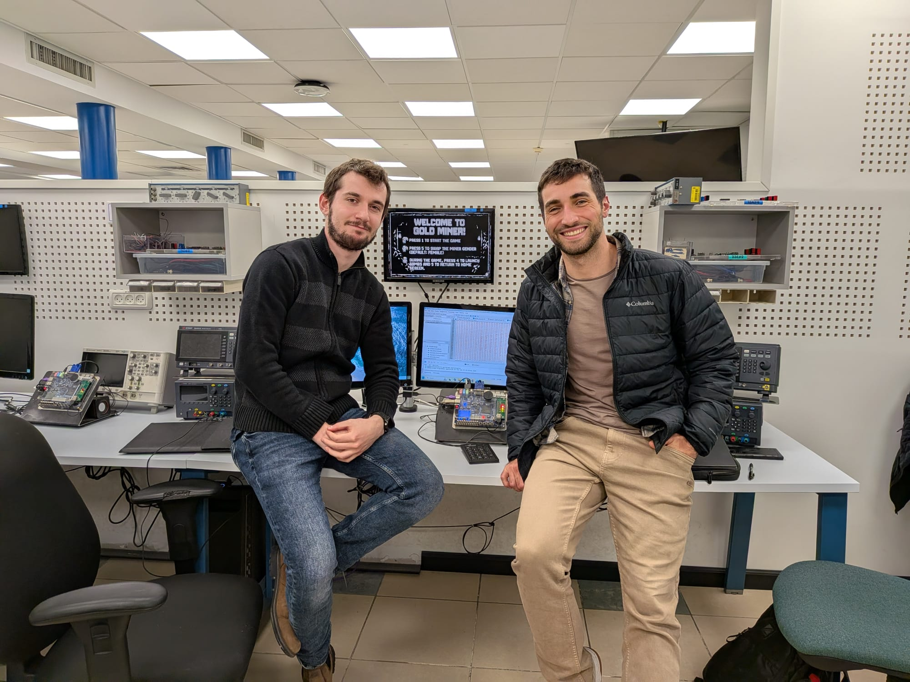

# FPGA Gold Miner - Enhanced Hardware Implementation

## Project Overview
An advanced real-time hardware system developed in **SystemVerilog** for the **Intel Cyclone V FPGA**. This project features a unique version of the classic "Gold Miner" game, integrating complex logic, audio, and multiple hardware peripherals.

## System Demonstration

### 🎥 Video Demos (Click to Watch)
| High-Quality Gameplay | Hardware & FPGA Setup |
| :---: | :---: |
|  |  |

### 🛠️ Collaboration & Hardware Lab
<table style="width:100%">
  <tr>
    <th style="text-align:center">Team Work (Alon & Yanay)</th>
    <th style="text-align:center">Alon Tkach - Hardware Setup</th>
  </tr>
  <tr>
    <td></td>
    <td></td>
  </tr>
</table>

## Key Features & Hardware Integration
* **Graphics & Display:** Custom-built **VGA Controller** (640x480 resolution).
* **Peripheral Support:** Full integration of a **Numeric Keypad** and keyboard interface.
* **Audio Module:** Integrated sound effects for immersive gameplay.
* **Advanced Mechanics:**
    * **Dynamic Bomb System:** Bombs deployed at random intervals with randomized explosion radii (Hardware-based **PRNG**).
    * **In-Game Shop:** Functional shop system for upgrades, managed via a dedicated **FSM** (Finite State Machine).
    * **Level Progression:** Multiple game levels with increasing difficulty.

## Technical Skills
* RTL Design & Synthesis using **Quartus Prime**.
* Complex State Machine (FSM) design and hardware-software synchronization.
* Timing analysis and debugging using **SignalTap** and **ModelSim**.

## Project Collaboration
This project was a joint effort by **Alon Tkach** and **Yanay Nazimov**. 
It showcases our ability to design a multi-module hardware system and handle real-time synchronization in FPGA design.
